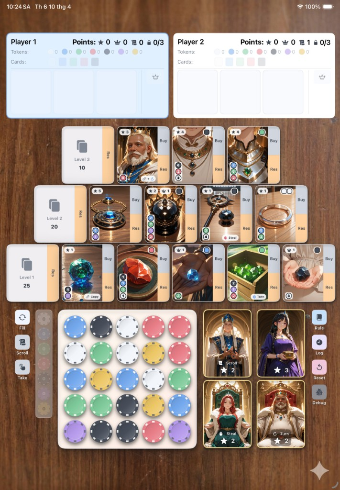

# Splendor Duel

A digital adaptation of the **Splendor Duel** board game, built natively for iPad with SwiftUI.

## About

Splendor Duel is a two-player strategy card game where players compete to collect gems, purchase development cards, and earn prestige points. This app brings the full board game experience to iPad with beautiful anime-styled card art, poker chip tokens, and smooth animations.

## Features

- **Full Game Rules** — Complete implementation of Splendor Duel mechanics including token drafting, card purchasing, reserving, royal cards, and multiple win conditions
- **Local Multiplayer** — Play against a friend on the same device with hot-seat mode
- **Peer-to-Peer Multiplayer** — Connect two iPads via MultipeerConnectivity for wireless play
- **Poker Chip Tokens** — Tokens rendered as realistic poker chips with concave centers and rim dashes
- **Card Inspection** — Tap any card on the pyramid to see which tokens you still need to buy it
- **Token Bag Preview** — See remaining tokens in the bag before refilling the board
- **Deck Card Counter** — Each deck shows how many cards remain
- **Game History & Undo** — Full move log with time-travel to any previous game state
- **Debug Mode** — Floating resource editor to modify player tokens, points, crowns, and privileges for testing
- **Fly Animations** — Cards and tokens animate smoothly between the board and player dashboards

## Win Conditions

A player wins by achieving any one of:

1. **20 Prestige Points** from purchased and royal cards
2. **10 Crowns** from purchased cards
3. **10 Points in a single gem color** from purchased cards

## How to Play

1. **Take Tokens** — Select tokens from the 5×5 board (up to 3 in a row/column, or 2 of the same color adjacent)
2. **Buy Cards** — Spend tokens to purchase development cards from the three-level pyramid
3. **Reserve Cards** — Set aside a card for later (max 3 reserved) and receive a gold token
4. **Claim Royals** — When you reach a crown milestone, choose a royal card for bonus prestige points
5. **Use Privileges** — Spend privilege scrolls to take any single token from the board

## Requirements

- iPad with iPadOS 17.0+
- Xcode 15.0+ to build from source

## Tech Stack

- **SwiftUI** — Declarative UI with Canvas-drawn poker chips
- **Swift Observation** — `@Observable` view model for reactive state management
- **MultipeerConnectivity** — Peer-to-peer wireless multiplayer
- **Swift Codable** — Game state serialization for history/undo and multiplayer sync

## Build & Run

1. Open `SplendorDuel.xcodeproj` in Xcode
2. Select an iPad simulator or connected iPad device
3. Build and run (⌘R)

## License

This project is for personal/educational use. Splendor Duel is a board game by Space Cowboys / Asmodee.
